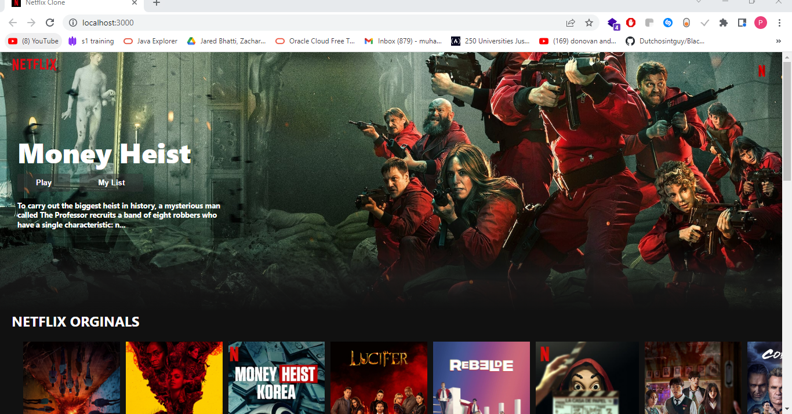

# quick movers portfolio
By Phares Muhambi
-[Screenshot] (#screenshot)

- [table of content] (#table of content)
- [Description](#description)
 - [Features](#features)
 - [Behaviour Driven Development](#Behaviour-Driven-Development)

 - [Requirements](#requirements)
 - [Installation Process](#installation-Process)
 - [Live Link](#Live-Link)
  - [Technology  Used](#technology-Used)
 - [Licence](#licence)
 - [Authors Info](#Authors-Info)

  
This project is a web application for streaming movies like netflix

## Features
As a user of the application,you will be able to :
1. See the available movies
2. Watch a movie

## Behaviour Driven Development|
| Behaviour      | Input        | Output       |
| :------------- | :----------: | -----------: |
|   |   Phares Muhambi |     |
| Enter your Email Address  | muhambiphares@gmail.com |   |
| Enter your message or comment   |  I would like to inquire about something     |     |
| Press Submit|     |Pop up "Phares Muhambi , we have received your message. Thank you for reaching out to us.|

 ## Installation Process
 ****
* Clone to the repo : git clone https://github.com/infosecmentor/netflix
* Delete package-lock.json
* Run npmi
* Run npm start

## Live Link
- Click this link to view the live application https://github.com/infosecmentor/netflix

## Technology  Used
* HTML 
* CSS 
* Reactjs
* Javascript

## Known Bugs
* no known bugs

## Licence
MIT License
Copyright (c) [2022] [Phares Muhambi]

Permission is hereby granted, free of charge, to any person obtaining a copy
of this software and associated documentation files (the "Software"), to deal
in the Software without restriction, including without limitation the rights
to use, copy, modify, merge, publish, distribute, sublicense, and/or sell
copies of the Software, and to permit persons to whom the Software is
furnished to do so, subject to the following conditions:

The above copyright notice and this permission notice shall be included in all
copies or substantial portions of the Software.

THE SOFTWARE IS PROVIDED "AS IS", WITHOUT WARRANTY OF ANY KIND, EXPRESS OR
IMPLIED, INCLUDING BUT NOT LIMITED TO THE WARRANTIES OF MERCHANTABILITY,
FITNESS FOR A PARTICULAR PURPOSE AND NONINFRINGEMENT. IN NO EVENT SHALL THE
AUTHORS OR COPYRIGHT HOLDERS BE LIABLE FOR ANY CLAIM, DAMAGES OR OTHER
LIABILITY, WHETHER IN AN ACTION OF CONTRACT, TORT OR OTHERWISE, ARISING FROM,
OUT OF OR IN CONNECTION WITH THE SOFTWARE OR THE USE OR OTHER DEALINGS IN THE
SOFTWARE. 

(#Phares  M Muhambi)
